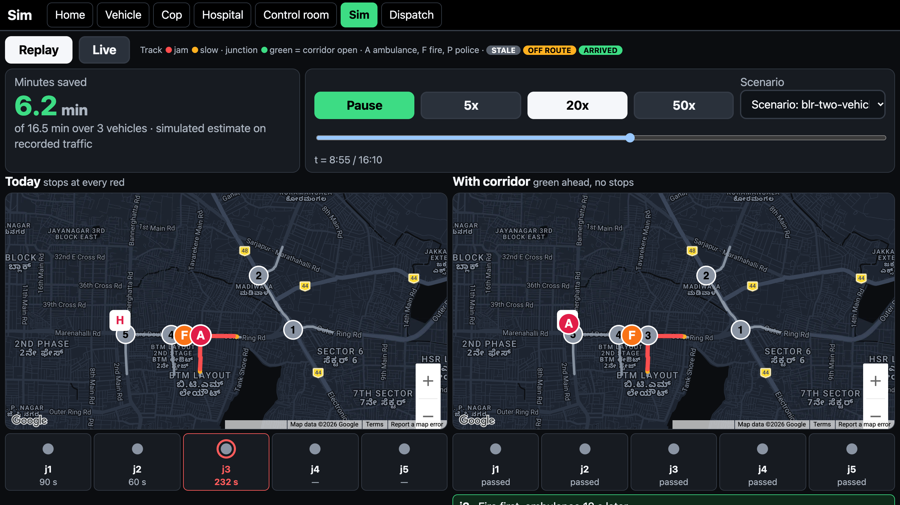
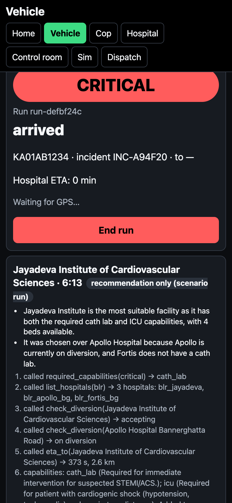
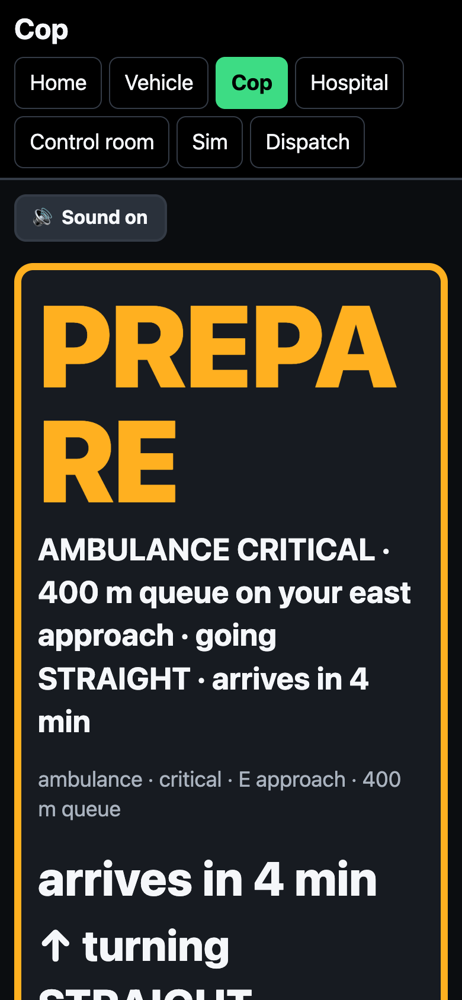
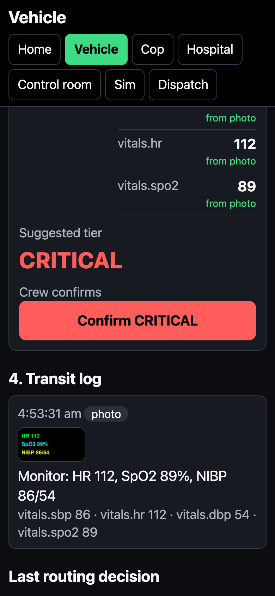
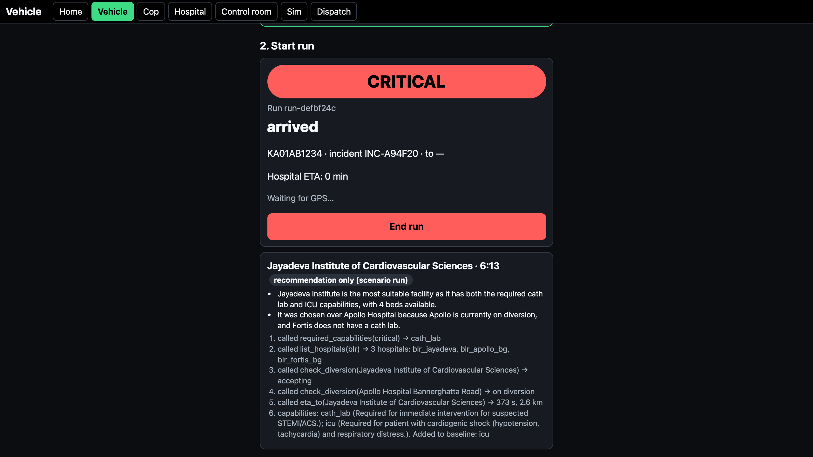
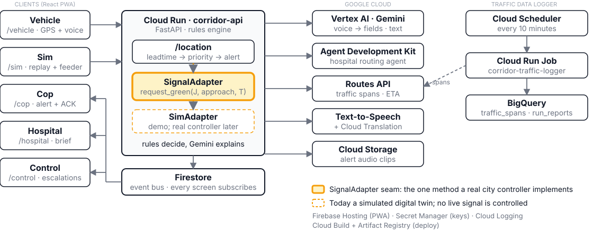
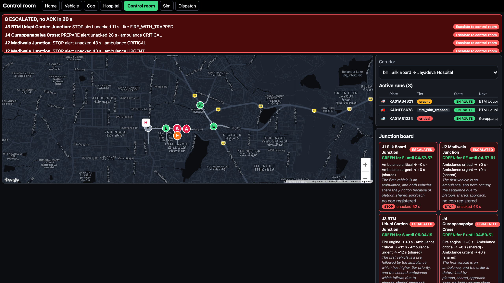

<!-- _class: dark -->
<!-- _paginate: false -->
<!-- _footer: "Google Cloud AI Builder Cup 2026 · Sustainability & Social Impact" -->



# Emergency Green Corridor

<div class="sub">Every red light costs a life.</div>

Tell the cop at the next junction, early enough, that an ambulance or fire engine is coming.

Built by Nandish · Live at green-corridor-2026.web.app

<!--
Emergency Green Corridor tells the cop at the next junction, early enough and with real numbers, that an ambulance, fire engine or police vehicle is coming. Gemini does the language work, deterministic rules do the safety-critical decisions. Everything in this deck is running at green-corridor-2026.web.app. Right: /sim?corridor=blr mid-replay, the same trace with and without the corridor.
-->

---

## The problem, seen daily on Hosur Road

<div class="stats">
<div class="stat"><b>7–10%</b><span>survival lost per minute in cardiac arrest without defibrillation</span></div>
<div class="stat"><b>2–3 km</b><span>covered in 30–50 min by Bengaluru ambulances at peak hours</span></div>
<div class="stat"><b>60%+</b><span>of Karnataka 108 cardiac, stroke and respiratory calls missed the 10-min target</span></div>
</div>

The officer at the junction has no idea they are coming. Full signal preemption needs city controller integration: years away.

<p class="cite">Sources: American Heart Association, CPR Facts and Stats (cpr.heart.org) and AHA, Circulation, 2017 · The Siasat Daily, 28 Jun 2026 (Karnataka Health Minister announcement) · CAG audit of Karnataka 108 EMS, 2014–19, reported by The News Minute, Dec 2020 (state-wide, not Bengaluru only)</p>

<!--
Every Bengaluru commuter has seen this on Hosur Road. The missing piece is not a siren, it is information reaching the one person who can clear the queue. The AHA figure is the commonly cited 7 to 10 percent per minute without CPR or defibrillation (the AHA public page says about 10 percent per minute without CPR). The Siasat figure is the ambulance speed at peak hours, not a median response time. The CAG figure is state-wide for Karnataka 108 over 2014-15 to 2018-19, so we call it that.
-->

---

## The 20-second demo

<div class="cols wide-left">
<div>

**Today:** stops at every red.
**With corridor:** cop warned early, queue cleared.
Silk Board → Jayadeva Hospital, the same scripted scenario in both lanes: GPS ticks generated along the real corridor roads, with hand-authored traffic spans (a 500 m queue at junction 3, 100 m at junction 4). The 3 vehicles run as one scenario: a critical ambulance, an ambulance following it as a platoon, and a fire engine.

<div class="stats two"><div class="stat"><b>≈ 16.5 min</b><span>saved across 3 vehicles</span></div> <!-- update from replay test --><div class="stat"><b>3</b><span>critical ambulance, platoon ambulance, fire engine</span></div></div>

</div>
<div>


</div>
</div>

<p class="cite">Simulated baseline on a scripted scenario, not a field measurement: per junction passed, cycle/4 + queue/2 m/s. Figure from the scenario replay (<code>blr-two-vehicles</code>). Live runs use live Routes traffic; scenario runs use the scripted spans.</p>

<!--
The /sim?corridor=blr screen replays the same trace twice. On the left the vehicle stops at each junction for the expected remaining red plus the queue drain, one method everywhere: per junction passed, cycle/4 + queue/2 m/s, the same formula in the replay and the report cards. On the right the corridor is cleared and only sequencing gaps remain. The replay on the current scenario saves about 16.5 minutes (update from the replay test), summed across the critical ambulance, the platoon ambulance behind it and the fire engine. That is the number the counter on screen reaches, computed in the browser from the scenario file and asserted by a unit test. The scenario is scripted: GPS ticks generated along the real roads, hand-authored spans. It is a simulated baseline, not a field measurement, and the slide says so. The first 20 seconds of the video show this replay at 50x.
-->

---

## What it does: six screens

<div class="cols three">
<div>


`/vehicle` voice, tier tap

</div>
<div>


`/cop` spoken alert, one ACK

</div>
<div>


`/hospital` live log, vitals, treatment so far (the ATMIST brief lands at ETA−5)

</div>
</div>

Also: `/dispatch` incident IDs · `/control` all runs and escalations · `/sim` with-vs-without replay.

<!--
Six React PWA routes, one Firestore event bus, every screen subscribes live. Unknown plates are rejected visibly, and preemption needs a registered plate plus an open incident. Corridor is chosen by ?corridor=blr or ?corridor=hyd.
-->

---

## How a cop gets warned: the lead-time engine

Live runs: Routes traffic spans (scenario runs: scripted spans) → queue metres → clearance time → two-stage alert.

<div class="cols wide-left">
<div>

```
jam_m   = Σ JAM m + 0.5 × Σ SLOW m
clear_s = 20 + jam_m / 2.0
eta_s   = 0.5 × routes_eta
        + 0.5 × distance / speed_60s
PREPARE            eta_s <= clear_s + 15
STOP CROSS TRAFFIC eta_s <= 30
```

</div>
<div>


</div>
</div>

No ACK in 20 s raises an escalation flag and an audit entry.

<!--
A 500 m queue alerts earlier than a 100 m queue, because the cop needs the time to clear exactly what is there. The constants (2.0 m/s clearance, 50/50 ETA blend) are deliberately simple and tunable. Each stage fires once per junction per run. Spoken in conversational English; Kannada and Telugu are switchable (Gemini rewrite, Cloud Translation, Text-to-Speech). jam_m walks back from the stop line to the first NORMAL span. eta_s has a floor of 3 m/s on speed.
-->

---

## Rules decide, Gemini explains

| Step | Who | What |
|---|---|---|
| 1. Extract | Gemini | speech or monitor photo → fixed JSON fields, never a score |
| 2. Tier | `acuity.py` | deterministic lookup → critical / urgent / stable; crew confirms with one tap |
| 3. Order | `priority.py` | sort by (tier, ETA): a **sequence, not a hold** |
| 4. Explain | Gemini | rewords the rule-built sentence for the cop ("Fire engine first, ambulance 12 s later"); validated, template if it fails |

A language model must not decide who lives. Rules are auditable, testable and carry self-checks.

<!--
Hallucination risk is removed from the safety path by construction. The model sits before the rules (extraction) and after them (rewording a sentence the rules already built, which is validated), never inside them. acuity.py, priority.py and leadtime.py each ship with assert-based self-checks. Priority is a sequence, everyone passes.
-->

---

## Where Gemini is load-bearing

<div class="cols wide-left">
<div>

| Job | What |
|---|---|
| Voice and photo extraction | speech, typed text or a monitor photo into a fixed schema, with no tools. |
| ATMIST handover | the hospital brief and prep checklist, generated at ETA minus 5 minutes. |
| Alert phrasing | the short spoken line each junction cop hears. |
| Sequencing sentence | Gemini rewords a rule-built template into one line; the result is validated and the template is used if it fails. |
| Cop voice notes to rule actions | a spoken report from the junction fills a fixed schema, and plain rules act on it. |
| After-action report | a plain summary of each finished run, with the timeline built in code. |
| Hospital routing agent | built on Agent Development Kit, with four tools and a code guard that checks its choice before it is applied. |

</div>
<div>



</div>
</div>

<p class="cite">Extraction runs on <code>gemini-3.1-flash-lite</code> with <code>gemini-3-flash-preview</code> as fallback; the brief, report, sequencing sentence and agent text use <code>gemini-3-flash-preview</code>. Synthetic patients only; a clinician confirms every extracted value.</p>

<!--
Each use changes what a human sees or hears next, and each has a form or template fallback if the model fails. Extraction runs on gemini-3.1-flash-lite with gemini-3-flash-preview as the fallback; the brief, the report, the sequencing sentence and the agent text use gemini-3-flash-preview. Extraction reads values visible on a monitor or ECG photo using the same schema, null where unreadable. Cop voice notes fill a fixed schema and plain rules act on it, so a misheard report can at worst extend a green by three minutes.
-->

---

## The agent: hospital routing on Agent Development Kit

<div class="cols">
<div>

```
required_capabilities(critical) -> cath_lab
list_hospitals(blr) -> 3 hospitals
check_diversion(Jayadeva) -> accepting
check_diversion(Apollo) -> on diversion
eta_to(Jayadeva) -> 373 s, 2.6 km
Added to baseline: icu
```

Destination Jayadeva, confidence 1.0. Alternatives: Apollo (diversion), Fortis (no cath lab).

An ADK agent on Vertex AI picks the destination after the crew confirms the tier, with up to two rejected alternatives and a confidence. `required_capabilities` is a keyword baseline for validation. A code guard re-checks the choice; any failure or 20 s timeout falls back to the nearest eligible hospital.

</div>
<div>



</div>
</div>

<!--
The trace on the left is a live routing trace from a rehearsal run (a critical chest-pain case); the screenshot on the right is the trace in /vehicle. The agent never changes acuity or signal priority. The roster is invented demo data and the slide says so. Four tools: list_hospitals(corridor) (mock capability and bed roster), eta_to(...) (traffic-aware Routes ETA), check_diversion(hospital_id) (a mock diversion feed), and required_capabilities(tier, fields), which is the keyword-table baseline used to validate the agent's own reading. The code guard rejects a dropped critical capability, an unknown hospital, a diverted one, no bed, or a missing capability. In this run the agent added ICU to the keyword baseline for the shock picture, rejected Apollo because it was on diversion and Fortis because it has no cath lab, and the guard accepted Jayadeva.
-->

---

## Architecture



<p class="cite">Cost by design: ~3 traffic-aware Routes calls per vehicle-minute; AI side effects run off the request path. Wired on main only. BigQuery ML: pipeline in place, retrained before submission on N rows ([fill at freeze]); not a deployed forecast.</p>

<!--
The SignalAdapter seam is the point: today SimAdapter writes the junction phase to Firestore, tomorrow a real controller adapter implements the same one method. Firestore is the single event bus and the accepted single point of failure for the demo. Cost is a design target: about 3 traffic-aware Routes calls per vehicle-minute, with Gemini, translation and speech side effects off the request path. Only products wired on main are shown. The BigQuery ML model is retrained before submission on peak-hour logger rows; state N from the freeze count.
-->

---

## Real data: the traffic logger

<div class="cols">
<div>

### Built
- Cloud Scheduler → Cloud Run Job during Bengaluru peak hours (08–11, 17–21 IST), running since 6 Oct
- Live jam and slow spans per approach → BigQuery `traffic_spans`, two corridors
- Same `jam_metres` as the live engine

</div>
<div>

### Proof of pipeline, not a forecast
- Rows so far: N ([fill at freeze]). The first 216 rows were midnight with zero queues
- BigQuery ML model: a pipeline proof until peak rows accumulate; retrained before submission, not a deployed forecast
- First step to a learning controller; clearance rate stays constant until observed

</div>
</div>

<p class="cite">Run reports (the with-vs-without report card per run) also land in BigQuery <code>run_reports</code>.</p>

<!--
Be explicit about scale: the logger has run on Cloud Scheduler during Bengaluru peak hours (08-11 and 17-21 IST) since 6 Oct, with N rows so far (fill N at freeze). The first 216 rows were logged at midnight with zero queues, so the model learned nothing from them. The BigQuery ML model is a pipeline proof until peak rows accumulate, retrained before submission, not a deployed forecast. Collection, feature view and training run end to end.
-->

---

## Sustainability

<div class="stats">
<div class="stat"><b>0.76 L/h</b><span>idle burn, small petrol car (low end of 0.2–0.5 gal/h)</span></div>
<div class="stat"><b>2.35 kg</b><span>CO₂ per litre of petrol (diesel 2.69 kg/L)</span></div>
<div class="stat"><b>0.6 kg</b><span>CO₂ idled by one 20-vehicle queue in 60 s (illustration)</span></div>
</div>

Preemption also idles the cross traffic, so the claim is the **net** effect. We size the green to the queue, so cross-traffic idling is bounded by `clear_s`.

`net_fuel_L = (ambulance-lane idling avoided − cross-traffic idling added) × idle_L_per_s`

**SDG 3.8** emergency care access (universal health coverage) · **SDG 11.2** sustainable transport.

<p class="cite">Idle burn: Argonne National Laboratory (Gaines, Rask, Keller), US DOE, 2014. CO₂: US EPA, GHG Equivalencies Calculator, 8,887 g/gal petrol and 10,180 g/gal diesel, 2024. The per-queue arithmetic (20 vehicles, 60 s) is an illustration, not a measurement or a net saving.</p>

<!--
In live runs the queue length comes from the same Routes spans the engine already reads, so the estimate costs nothing extra. Be honest that preemption makes cross traffic idle too: the net effect is what counts, and because the green is sized to the queue, the cross-traffic idling is bounded by clear_s. The per-queue figure below is an illustration of scale, not a net saving. Arithmetic for one queue: 20 vehicles x 0.76 L/h x 60 s / 3600 = 0.25 L; x 2.35 kg/L = 0.6 kg CO2. We use the low end of the Argonne passenger-car range as a conservative idle rate. Argonne tested US cars; we have not sourced an Indian auto-rickshaw or bus figure, so we do not claim one. Divide the gallon values by 3.785 for litres.
-->

---

## Deployment path, and honesty

<div class="cols">
<div>

| Phase | What |
|---|---|
| **Today** | cop alerts, no hardware, a phone |
| **Phase 2** | real controller behind `SignalAdapter` |
| **Phase 3** | learning controller on junction data |

</div>
<div>

### Stated plainly
- Traffic signals are simulated behind an adapter; the demo scenario uses hand-authored traffic spans
- Patients are synthetic; no user accounts; device-scoped tokens protect vehicle, cop and run actions; demo endpoints are rate-limited but reachable
- Minutes saved is a simulation estimate

</div>
</div>

<!--
We would rather be believed on a smaller claim. Cop alerts are the part that needs no city integration. There are no user accounts by design: device-scoped tokens protect vehicle, cop and run actions, and the rest stays reachable so judges can open every screen.
-->

---

## Global by configuration

<div class="cols">
<div>

| | `blr` | `hyd` |
|---|---|---|
| Corridor | Silk Board → Jayadeva | Hyderabad |
| Alert language | English, Kannada | English, Telugu |
| Switch | `?corridor=blr` | `?corridor=hyd` |

</div>
<div>



</div>
</div>

A corridor is one JSON file: junctions, approaches, signal cycle, language. No code change.

<!--
Adding a city is a config change plus a hospital roster, no code. The Hyderabad corridor proves the schema is not Bengaluru-shaped. Cop alerts work anywhere Routes reports traffic. The screenshot is /control?corridor=blr, a live rehearsal run; the Corridor selector on the same page switches to Hyderabad.
-->

---

<!-- _class: dark -->
<!-- _footer: "Google Cloud AI Builder Cup 2026" -->

# Try it

<div class="stats two">
<div class="stat"><b>Live</b><span>green-corridor-2026.web.app</span></div>
<div class="stat"><b>Repo</b><span>github.com/Nandish3010/ideal-disco</span></div>
</div>

API health: corridor-api-919512130399.asia-south1.run.app/health · Demo video: [link, 3 minutes]

**Ask:** feedback from traffic police and 108 operators, and a pilot junction.

<!--
Close on the one-line pitch: every red light costs a life, and the first fix does not need to wait for the signal controller. Fill in the video link before export.
-->
